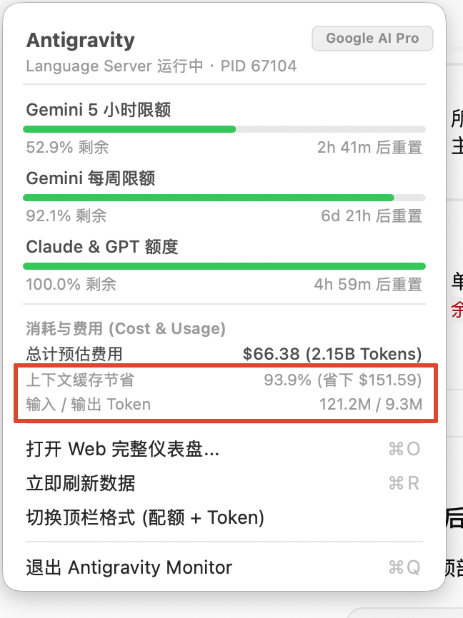
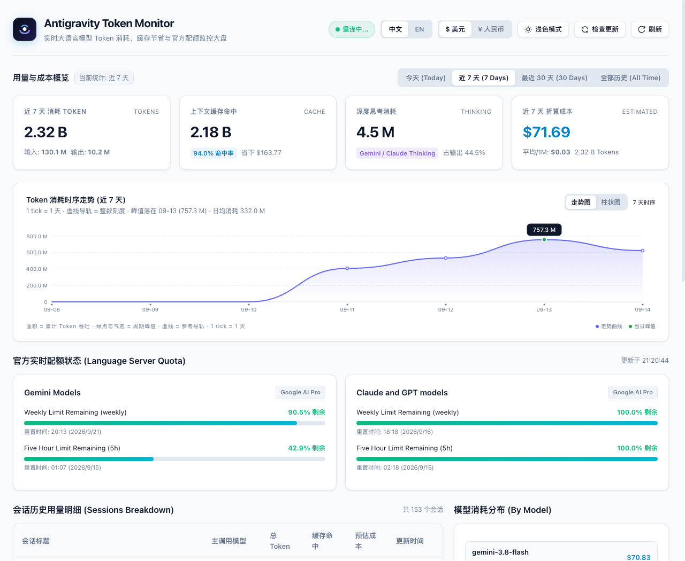

<div align="center">


# Antigravity Token Monitor

<p><strong>专为 Google DeepMind Antigravity 打造的本地 Token 消耗与官方配额监控工具。</strong><br>
包含原生 macOS 菜单栏常驻卡片、响应式 Web 大盘与终端 CLI，零外部依赖，零数据外传。</p>

<p>
  <a href="https://github.com/QingYunA/antigravity-token-monitor/releases"></a>
  
  
  <a href="./LICENSE"></a>
</p>

<p>
  <a href="#核心功能">核心功能</a> ·
  <a href="#快速上手">快速上手</a> ·
  <a href="#数据采集原理">数据原理</a> ·
  <a href="#一键更新">升级更新</a> ·
  <a href="./README_EN.md">English Documentation</a>
</p>

</div>

---

<!-- 首屏直观展示：真实 macOS 状态栏卡片与 Web 仪表盘 -->
<div align="center">
  
  <p><em>macOS 菜单栏常驻卡片：随时查看近 7 天与当天用量、缓存命中节省及 5h/周限额倒计时</em></p>
  <br>
  
  <p><em>响应式 Web 监控大盘：原生 SVG 1:1 像素时序走势、按模型消耗分布与单步思考链探查</em></p>
</div>

---

## 为什么做这个工具？

用 Google DeepMind Antigravity 写代码时，后台 Agent 会频繁调用模型，不知不觉就吃光了配额。

平时开发常遇到三个痛点：
1. **配额像个黑盒**：官方没有桌面常驻微件，直到弹出 `ResourceExhausted` 报错才发现配额见底。
2. **消耗没有感知**：跑完一次复杂任务，心里没数到底用了多少 Token，更不知道缓存到底省了多少钱。
3. **担心数据泄露**：市面上一些监控插件要把会话和日志上传到第三方云端，在企业或私有项目里根本不敢用。

**Antigravity Token Monitor** 纯本地运行。直接读取本机的 SQLite 数据库与 Language Server 进程，不用填任何 API Key，不发公网请求，开箱即用。

---

## 核心功能

- **常驻 Mac 菜单栏：** 采用 Objective-C / AppKit 原生编写。体积仅 200KB，常驻内存约 15MB，免安装即可双击运行。
- **官方配额倒计时：** 本地直连 Language Server 进程，实时显示 Gemini 5 小时与每周配额剩余百分比，精准到分钟。低于 10% 自动变红预警。
- **时序走势图表 (1:1 动态像素)：** 纯原生 SVG 渲染，支持**走势图**与**柱状图**平滑切换。严格按容器物理像素绘制，杜绝文字拉伸与圆形变扁，带防抖自适应。
- **思考链 (Thinking) 深度探查：** 完整展示 Gemini 与 Claude 模型的深度思考 Token 消耗及其在总输出中的占比。
- **单步脉冲与会话分析：** 还原每一次交互的输入、缓存命中、正文输出与预估费用，会话历史一目了然。
- **中英双语与明暗主题：** 状态栏卡片与 Web 仪表盘均支持中英文无缝切换，支持浅色与深色科技感主题。
- **零网络侵入与数据安全：** 仅读取本机 `~/.gemini/antigravity` 目录，绝不上传任何代码、Prompt 或会话内容。

---

## 快速上手

### 方式 1：下载 macOS DMG 镜像安装（推荐）

1. 前往 [Releases 发布页面](https://github.com/QingYunA/antigravity-token-monitor/releases/latest) 下载 `Antigravity-Monitor-macOS-Universal.dmg`。
2. 双击打开 DMG，将 `Antigravity Monitor` 拖入 `Applications` 应用程序文件夹。
3. 在启动台或聚焦搜索打开应用，顶部菜单栏即可常驻微标。

> **说明**：预编译产物为通用二进制（Universal Binary），原生支持 Apple Silicon（M1/M2/M3/M4）与 Intel 芯片 Mac。

---

### 方式 2：从源码一键构建运行

```bash
git clone https://github.com/QingYunA/antigravity-token-monitor.git
cd antigravity-token-monitor

# 编译并立即在菜单栏启动
./macos/build.sh run

# 打包为标准 macOS DMG 镜像
./macos/build.sh dmg

# 或直接安装到 /Applications
./macos/build.sh install
```

---

### 方式 3：启动 Web 监控大盘

需要查看 30 天历史、时序曲线或单步思考链明细时使用：

```bash
python3 server.py
```

在浏览器打开：[http://127.0.0.1:8765](http://127.0.0.1:8765)

- 支持浅色 / 高级暗黑模式即时切换。
- 顶栏支持 `[ 中文 | EN ]` 语言切换与汇率切换。
- 走势图与柱状图支持自由切换，带悬浮发丝准星与数据卡片。

---

### 方式 4：终端命令行速查

写代码间隙在终端顺手看一眼用量：

```bash
python3 cli.py
```

输出示例：
```text
============================================================
              ANTIGRAVITY TOKEN MONITOR REPORT              
============================================================
📅 统计时间范围: 2026-03-08 至 2026-03-14 (近 7 天)
------------------------------------------------------------
📊 核心消耗指标:
   • 累计消耗:       2.28B Tokens (折算价值: $70.46)
   • 缓存命中:       2.15B Tokens (缓存节省: $160.95)
   • 缓存利用率:     94.0%
------------------------------------------------------------
⏱️ 官方配额状态:
   • Gemini 5h 限额: 63.1% 剩余 (重置倒计时: 4h 08m)
   • 每周限额:       93.9% 剩余 (重置倒计时: 6d 23h)
============================================================
```

---

## 数据采集原理

本工具完全依赖 Antigravity 本地数据，无任何侵入性：

| 监控项 | 采集来源 | 机制说明 |
| :--- | :--- | :--- |
| **实时配额与倒计时** | 本地 Connect-RPC | 自动探测本机运行的 `antigravity-language-server` 端口与 CSRF 凭证，调用标准 RPC 接口 `RetrieveUserQuotaSummary` 获取毫秒级配额数据。 |
| **Token 消耗与成本** | 本地 SQLite 数据库 | 读取 `~/.gemini/antigravity/conversations/*.db`，解码单步中的 Protobuf 负载，提取 Prompt、Output、Thinking 与 Cache Token 精准计费。 |
| **零依赖架构** | Python 3 标准库 | 服务端无需安装 pip 依赖包（仅依赖 `http.server`、`sqlite3`、`urllib` 等标准库）。 |

---

## 升级更新

- **菜单栏检查**：在 Mac 状态栏菜单中点击 `检查更新...` 查看最新版本。
- **Web 大盘提示**：发现新版本时，大盘顶部自动亮起升级提醒。
- **终端平滑升级**：在项目根目录下执行脚本即可一键拉取最新代码并热重启：
  ```bash
  ./update.sh
  ```

---

## 自动化测试

运行全量测试套件（含接口测试、解析器测试与 RPC 客户端模拟测试）：

```bash
python3 run_tests.py
# 或使用标准命令
python3 -m unittest discover -s . -p "test_*.py"
```

---

## 开源协议

本项目采用 [MIT License](./LICENSE) 授权开源。
